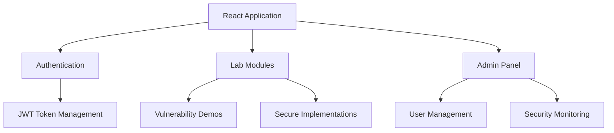
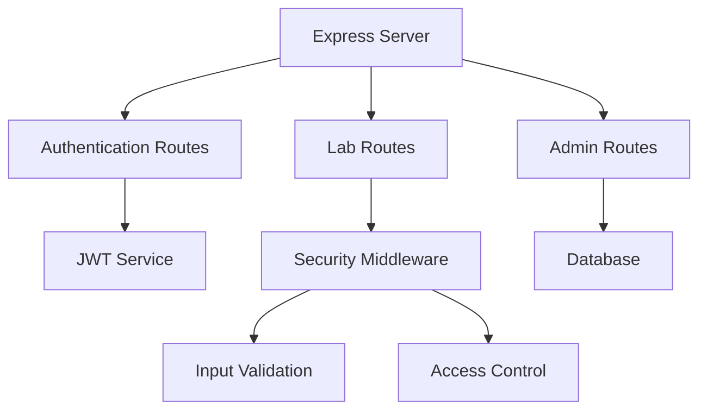

# 🛡️ Security Training Lab - OWASP Top 10


A comprehensive, interactive security training environment for learning about OWASP Top 10 vulnerabilities through hands-on examples and real-world scenarios.

## 📚 Table of Contents

- [Features](#-features)
- [Architecture](#-architecture)
- [Installation](#-installation)
- [Lab Sections](#-lab-sections)
- [Security Features](#-security-features)
- [API Documentation](#-api-documentation)
- [Development](#-development)
- [Deployment](#-deployment)

## ✨ Features

### 🎯 Core Features

- **Interactive Labs**: Hands-on experience with real vulnerabilities
- **Dual Mode**: Switch between vulnerable and secure implementations
- **Real-time Feedback**: Immediate results and explanations
- **Progress Tracking**: Monitor your learning journey
- **Admin Dashboard**: Comprehensive security monitoring

### 🔐 Security Training Modules

1. **Access Control**
   - Role-based access control
   - Authorization mechanisms
   - Privilege escalation prevention

2. **Cryptography**
   - Secure password storage
   - Data encryption/decryption
   - Key management

3. **Injection Prevention**
   - SQL injection scenarios
   - Input validation
   - Parameterized queries

4. **Authentication**
   - Multi-factor authentication
   - Session management
   - Password policies

5. **Data Protection**
   - XSS prevention
   - CSRF protection
   - Data integrity checks

## 🏗️ Architecture

### Frontend Architecture



### Backend Architecture



## 🚀 Installation

1. **Clone the Repository**
```bash
git clone https://github.com/yourusername/security-training-lab.git
cd security-training-lab
```

2. **Install Dependencies**
```bash
npm install
```

3. **Configure Environment**
```bash
cp .env.example .env
```

4. **Environment Variables**
```env
PORT=3000
JWT_SECRET=your-secret-key-here
ALLOWED_ORIGINS=http://localhost:5173
NODE_ENV=development
```

## 🔬 Lab Sections

### 1. Broken Access Control
- **Path**: `/lab/access-control`
- **Features**:
  - Role-based access demonstration
  - Privilege escalation scenarios
  - Access control best practices

### 2. Cryptographic Failures
- **Path**: `/lab/crypto`
- **Features**:
  - Weak vs strong encryption
  - Password hashing comparison
  - Secure key management

### 3. Injection
- **Path**: `/lab/injection`
- **Features**:
  - SQL injection scenarios
  - Input validation techniques
  - Query parameterization

### 4. Insecure Design
- **Path**: `/lab/insecure-design`
- **Features**:
  - Business logic flaws
  - Security by design principles
  - Risk assessment

### 5. Security Misconfiguration
- **Path**: `/lab/misconfig`
- **Features**:
  - Server configuration issues
  - Security headers
  - Error handling

### 6. Vulnerable Components
- **Path**: `/lab/outdated`
- **Features**:
  - Dependency management
  - Version control
  - Security updates

### 7. Authentication Failures
- **Path**: `/lab/auth`
- **Features**:
  - Authentication bypass
  - Session management
  - Brute force protection

### 8. Data Integrity Failures
- **Path**: `/lab/integrity`
- **Features**:
  - XSS prevention
  - CSRF protection
  - Input sanitization

### 9. Logging Failures
- **Path**: `/lab/logging`
- **Features**:
  - Audit trails
  - Security monitoring
  - Log analysis

### 10. SSRF
- **Path**: `/lab/ssrf`
- **Features**:
  - URL validation
  - Server-side request forgery
  - Network security

## 🛡️ Security Features

### Authentication & Authorization
- JWT-based authentication
- Role-based access control
- Session management
- Password policies

### Data Protection
- AES-256-GCM encryption
- Bcrypt password hashing
- CSRF tokens
- XSS protection

### Network Security
- CORS configuration
- Security headers
- Rate limiting
- Request validation

## 📡 API Documentation

### Authentication Endpoints

#### Login
- **URL**: `/api/auth/login`
- **Method**: `POST`
- **Body**:
```json
{
  "username": "string",
  "password": "string"
}
```
- **Response**:
```json
{
  "user": {
    "id": "number",
    "username": "string",
    "role": "string"
  },
  "token": "string"
}
```

#### Register
- **URL**: `/api/auth/register`
- **Method**: `POST`
- **Body**:
```json
{
  "username": "string",
  "password": "string",
  "email": "string"
}
```

### Lab Endpoints

#### Cryptography
- **URL**: `/api/crypto/encrypt/secure`
- **Method**: `POST`
- **Body**:
```json
{
  "text": "string",
  "key": "string"
}
```

#### Notes
- **URL**: `/api/notes/secure`
- **Method**: `POST`
- **Auth**: Required
- **Body**:
```json
{
  "title": "string",
  "content": "string"
}
```

## 💻 Development

### Running the Application

1. **Start Development Servers**
```bash
npm run dev
```

This command starts:
- Frontend server (port 5173)
- Main API server (port 3000)
- Internal server (port 5000)

### Project Structure

```
security-training-lab/
├── src/
│   ├── client/           # Frontend React application
│   │   ├── components/   # Reusable components
│   │   ├── pages/        # Page components
│   │   └── utils/        # Frontend utilities
│   ├── server/           # Main API server
│   │   ├── routes/       # API routes
│   │   ├── middleware/   # Custom middleware
│   │   └── utils/        # Backend utilities
│   └── config/           # Configuration files
├── docs/                 # Documentation
└── public/              # Static assets
```

## 🚀 Deployment

### Production Build

1. **Build the Application**
```bash
npm run build
```

2. **Production Environment**
```env
NODE_ENV=production
JWT_SECRET=strong-random-secret
ALLOWED_ORIGINS=https://your-domain.com
```

### Security Checklist

✅ Enable HTTPS
✅ Set secure headers
✅ Configure rate limiting
✅ Enable logging
✅ Set up monitoring
✅ Regular security updates

## 👥 Test Accounts

### Admin User
- Username: `admin`
- Password: `admin123`
- Access: Full system access

### Regular User
- Username: `user`
- Password: `user123`
- Access: Limited to user features

## 📝 License

MIT License - See [LICENSE](LICENSE) file for details

## 🤝 Contributing

1. Fork the repository
2. Create your feature branch
3. Commit your changes
4. Push to the branch
5. Create a Pull Request

## 🔒 Security Notes

This lab contains intentionally vulnerable code for educational purposes. Never use vulnerable implementations in production. Always:

1. Use secure configurations
2. Implement proper authentication
3. Validate all inputs
4. Use prepared statements
5. Implement access control
6. Use secure crypto
7. Enable security headers
8. Implement logging
9. Validate URLs
10. Keep dependencies updated